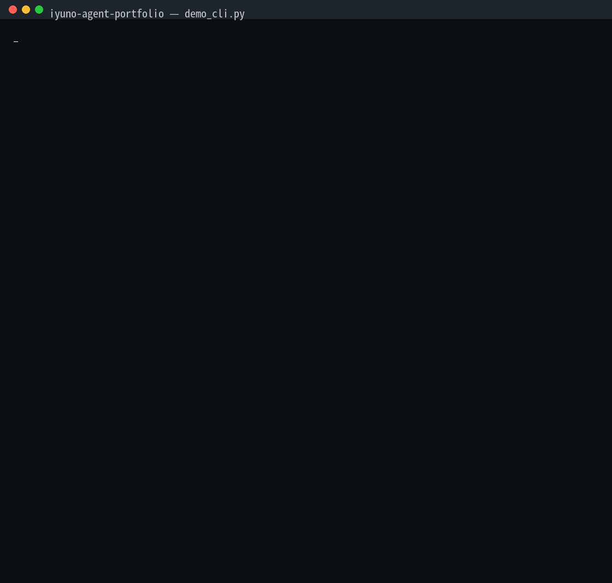

# iyuno-agent-portfolio

공개 기술·보안 문서를 검색해서 **출처(citation)를 달아 답하는 AI 에이전트**입니다.
RAG 검색과 tool calling을 결합했고, 실제 채용 공고의 요구사항을 하나씩 코드로 옮겨
증명하는 것을 목표로 만들었습니다.

> **Iyuno — AI Agent Engineer** · 서울 · 하이브리드 · 정규직
> 마감: 2026-09-30 · 공고 번호 JR101122
> https://iyuno.wd3.myworkdayjobs.com/careers/job/seoul/ai-agent-engineer_jr101122

"공고 → GitHub 증거" 과제로 진행했습니다. 이력서에 한 줄 적는 대신, 공고의 요구사항
문장마다 실제로 동작하고 테스트할 수 있는 구현을 대응시켰습니다.



## 공고 요구사항 → 구현 위치

| 공고 요구사항 | 구현 위치 |
|---|---|
| LLM 기반 AI Agent 시스템 설계·개발 | `agent/router.py`: 질문 분류 → 도구 호출 → 근거 기반 답변의 다단계 라우터 |
| RAG 검색·응답 시스템과 tool calling | `agent/retriever.py`(RAG 검색) + `agent/tools.py`(calculator / doc_search / policy_lookup) |
| API·데이터베이스 통합 및 다단계 workflow | `agent/router.py`의 `answer_query`(규칙 기반) / `answer_query_llm`(Claude API 사용) |
| 평가·피드백 루프, latency·cost·reliability 개선 | `evaluation/run_eval.py` → `evaluation/metrics.json`, `evaluation/metrics.png` |
| (전제) 한계를 정직하게 설명 | 아래 **한계** 항목 |

## 구조

```
사용자 질문 → 라우터 ──→ RAG 검색기 ──┐
               │                     ├─→ 답변 + 출처 + 호출 로그
               └──────→ 도구 / API ───┘
```

- **라우터** (`agent/router.py`): 질문을 계산 / 문서 직접 조회 / 일반 질문으로 분류하고,
  요청 하나당 도구 호출을 최대 `MAX_STEPS`회로 제한합니다(최소 권한 원칙,
  `data/raw/least-privilege-agent-permissions.md` 참고).
- **검색기** (`agent/retriever.py`): 문서 20개를 60조각(chunk)으로 나눠 TF-IDF와
  코사인 유사도로 검색합니다. 외부 의존성과 네트워크 없이 동작하도록 만들었고,
  인터페이스를 좁게 설계해 나중에 임베딩 기반 검색으로 교체하기 쉽습니다.
- **도구** (`agent/tools.py`): `calculator`(`eval`을 쓰지 않는 AST 기반 안전 계산기),
  `doc_search`(검색기 호출), `policy_lookup`(문서 id로 정확히 조회). 모든 호출은
  소요 시간과 함께 `CALL_LOG`에 기록됩니다.

### 실행 모드 두 가지

| 모드 | 함수 | 동작 | 용도 |
|---|---|---|---|
| 오프라인 추출 모드 | `answer_query()` | 가장 관련 있는 문서 조각을 그대로 인용하고 출처를 붙임. 결과가 항상 같음 | 테스트, CI, 평가 |
| LLM 모드 | `answer_query_llm()` | 검색한 조각을 근거로 Claude가 답을 작성하고 조각 id를 인용. 근거가 부족하면 "모른다"고 답하도록 지시 | 데모, 실제 사용 |

LLM 모드는 `ANTHROPIC_API_KEY`가 없거나 API 호출이 실패하면 자동으로 오프라인 모드로
전환되므로, 키가 없어도 데모가 멈추지 않습니다. 현재 저장소의 평가 수치는 모두 오프라인
모드 기준입니다.

## 설치와 실행

```bash
python3 -m venv .venv && source .venv/bin/activate
pip install -r requirements.txt

# 1) 문서를 조각으로 나눠 chunks.json 생성
python -m agent.ingest

# 2) 테스트 실행
pytest -v

# 3) 평가 실행 (질문 44개) → evaluation/metrics.json, metrics.png
python -m evaluation.run_eval

# 4) 데모 실행
streamlit run demo/app.py
```

LLM 모드를 쓰려면 4단계 전에 `export ANTHROPIC_API_KEY=sk-ant-...`를 설정하고, 데모
사이드바에서 "Claude API 사용"을 켜세요. 같은 질문을 두 모드로 비교한 결과는 아래 명령으로
`evaluation/llm_examples.md`에 저장됩니다.

```bash
python -m scripts.run_llm_examples
```

## 평가 결과

질문 44개(`evaluation/eval_set.json`)를 오프라인 모드로 평가한 결과입니다.

| 지표 | 대상 | 점수 | 의미 |
|---|---|---|---|
| hit@4 | 일반·multi_hop 32개 | 1.00 | 검색 상위 4개 조각 안에 정답 문서가 있는 비율 |
| faithfulness proxy | 일반·multi_hop 32개 | 0.81 | 답변의 첫 번째 출처가 정답 문서와 일치하는 비율 |
| **hit@4 (바꿔 말한 질문)** | **8개** | **0.00** | 문서와 핵심 단어가 겹치지 않는 질문에서의 hit@4 |
| **faithfulness proxy (바꿔 말한 질문)** | **8개** | **0.00** | 같은 질문에서의 출처 일치율 |
| arithmetic accuracy | 계산 2개 | 1.00 | 계산기 도구가 정확한 값을 반환한 비율 |
| refusal accuracy | 범위 밖 2개 | 1.00 | 답할 수 없는 질문을 추측하지 않고 거절한 비율 |
| 평균 응답 시간 | 전체 | 약 0.5 ms | 네트워크 없이 TF-IDF로만 검색 |

**점수를 읽는 법:** 일반 질문의 hit@4 1.00은 규모가 작고(문서 20개), 질문이 문서와 같은
단어를 쓰기 때문에 높게 나온 값입니다. 이 점을 확인하려고 뜻은 같지만 단어를 바꾼 질문
8개(`p01`~`p08`)를 따로 넣었고, 여기서는 정답 문서를 하나도 찾지 못했습니다. 즉 현재
검색기는 **단어가 일치할 때만 잘 동작하며**, 이것이 가장 먼저 개선할 부분입니다.

질문별 결과는 `evaluation/metrics.json`, 차트는 `evaluation/metrics.png`에 있습니다.

## 한계

- **검색이 TF-IDF 방식이라 뜻은 같고 단어가 다른 질문을 놓칩니다.** 위의 바꿔 말한 질문
  0/8이 그 증거입니다. 다음 단계는 임베딩 기반 검색(또는 BM25와 섞은 하이브리드 검색)이며,
  `Retriever` 인터페이스를 좁게 만들어 두어 나머지 코드는 건드리지 않고 교체할 수 있습니다.
- **faithfulness proxy가 1.0이 아니라 0.81입니다.** 32개 중 6개(일반 질문 5개,
  multi_hop 1개)에서 첫 번째 출처가 정답 문서가 아니라 주제가 비슷한 다른 문서였습니다.
  예를 들어 "RAG란?" 질문에 환각(hallucination) 문서가 먼저 인용됐습니다.
- **오프라인 모드는 답을 "생성"하지 않습니다.** 가장 관련 있는 조각을 그대로 인용합니다.
  근거를 속이지 않고 유료 API 없이 CI에서 돌릴 수 있도록 일부러 이렇게 만들었지만,
  답변의 자연스러움은 LLM 모드보다 떨어집니다.
- **LLM 모드는 아직 정량 평가를 하지 않았습니다.** 평가 수치는 모두 오프라인 모드
  기준이고, LLM 모드는 `scripts/run_llm_examples.py`로 예시를 확인하는 단계입니다.
- **문서가 영어라 한국어 질문은 검색되지 않습니다.**
- **문서 20개는 데모용으로 직접 정리한 작은 말뭉치입니다** (`data/SOURCES.md` 참고).
  실서비스 규모의 지식 베이스가 아닙니다.
- **인증·권한 계층이 없습니다.** 로컬 데모용이며, 외부에 공개하려면
  `data/raw/api-authentication-patterns.md`, `zero-trust-architecture.md`에 정리한
  방식이 필요합니다.

## 데이터와 라이선스

문서별 주제와 출처는 `data/SOURCES.md`, 코드 라이선스는 `LICENSE`(MIT)를 참고하세요.

## 폴더 구조

```
agent/             검색기, 도구, 라우터 (에이전트 본체)
data/raw/          원본 문서 20개 + SOURCES.md
data/processed/    agent/ingest.py로 생성한 chunks.json
evaluation/        eval_set.json, run_eval.py, metrics.json/.png (생성 결과)
tests/             pytest 테스트 21개
demo/              Streamlit 데모와 시연 GIF
scripts/           문서 생성 스크립트, LLM 모드 예시 스크립트
.github/workflows/ci.yml   GitHub Actions: 설치 → 문서 처리 → 테스트 → 평가
```

## CI

[](https://github.com/minjun0122-commits/iyuno-agent-portfolio/actions/workflows/ci.yml)

푸시할 때마다 의존성 설치 → 문서 처리 → `pytest` → `evaluation/run_eval.py` 전체 과정을
실행하고, 평가 결과 파일을 올려 확인할 수 있게 합니다.

## 회고

`RETROSPECTIVE.md`를 참고하세요.
